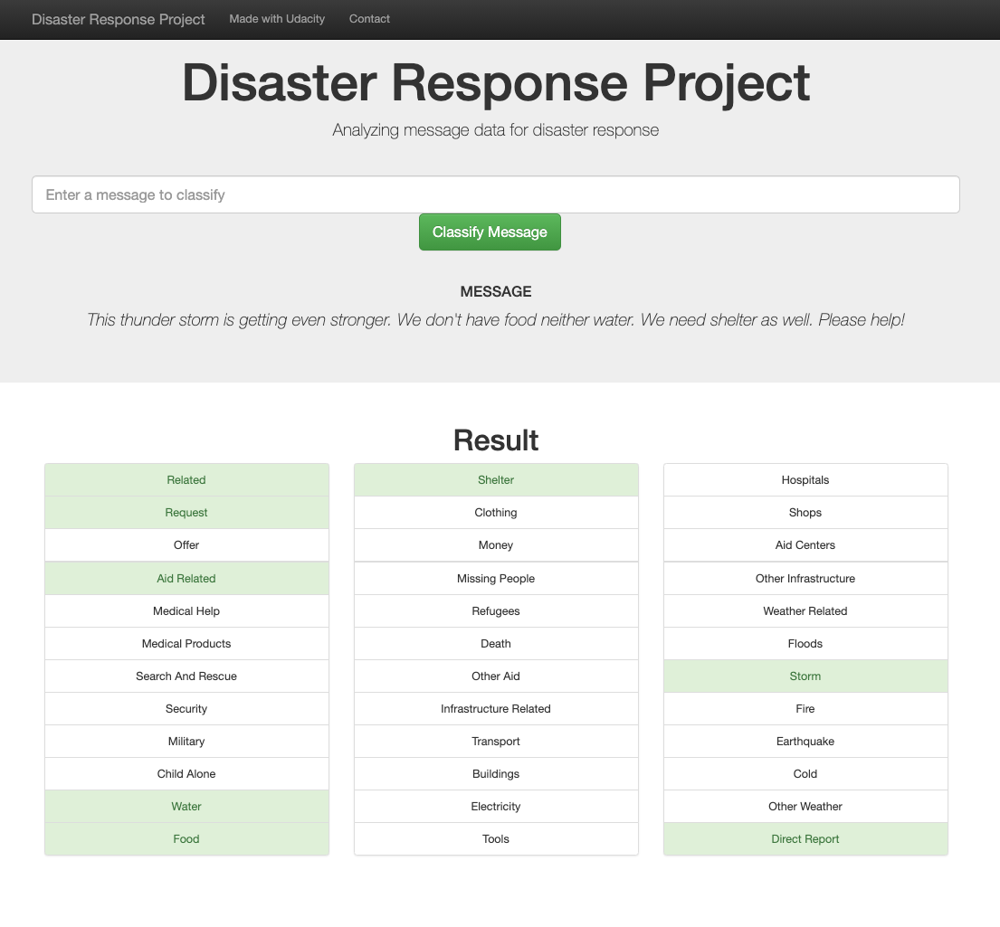
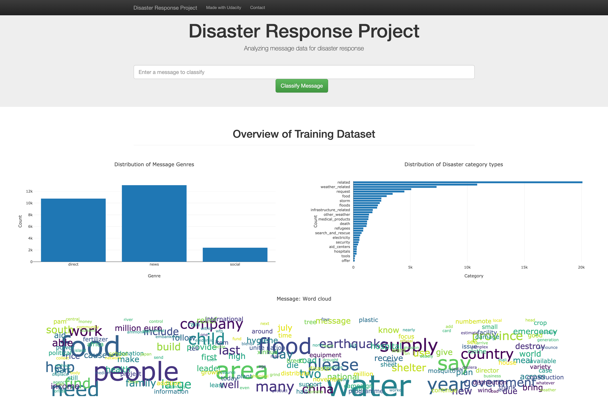

# Disaster Response Pipeline Project

Machine learning project to classify disaster labeled data from [Figure Eight](https://appen.com). 
This project is also part of a Nanodegree in Data Science at [Udacity](https://www.udacity.com/) and it has 3 main 
components:

1. ETL scripts to process the data
2. Machine Learning pipeline to extract features, training and optimize a classifier model using grid search
3. Web application to evaluate the model and get statistics about the training set data

### Table of Contents

1. [Instructions](#instructions)
3. [File Descriptions](#files)
4. [Web app](#app)
5. [Licensing, Authors, and Acknowledgements](#licensing)

## Instructions 
1. Run the following commands in the project's root directory to set up your database and model.

    - To run ETL pipeline that cleans data and stores in database
        `python data/process_data.py data/disaster_messages.csv data/disaster_categories.csv data/DisasterResponse.db`
    - To run ML pipeline that trains classifier and saves
        `python models/train_classifier.py data/DisasterResponse.db models/classifier.pkl`

2. Run the following command in the app's directory to run your web app.
    `python run.py`

3. Go to http://0.0.0.0:3001

## File Descriptions 

* **data/**: ETL scripts to process data and save it into a relation database
* **models/**: Machine learning pipeline code for extracting features, training and optimize the model using grid search
* **logs/**: Output of best model performance (precision, recall and f1-score) using test data
* **plot_data/**: Scripts to wrangle data and prepare web app plots
* **app/**: Flask app code
* **test/**: Unit tests to validate customized tokenizers and sklearn estimators

## Web app 
### Evaluating the model
For a given message, the app runs the model and outputs the predicted categories.

### Training set statistics
Overview of training set distribution and input message content.

## Licensing, Authors, and Acknowledgements
Must give credit to Figure Eight and Udacity for providing the dataset.

This project is under MIT License.

